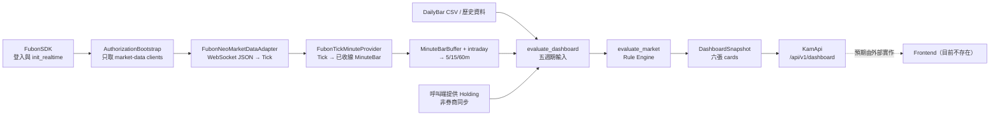

# kam-market-ai 專案結構分析

> 掃描日期：2026-07-28。此報告依目前工作目錄的實際檔案與程式碼關係撰寫；未修改任何既有程式或設定。

## 結論摘要

此 Repository 並非單一、完整串接的 Web 應用，而是並存兩條演進中的 Python 程式線：

1. **根目錄主線（`src/kam_market_ai`）**：V0.1 的研究／Shadow 架構。它對富邦 Neo SDK 建立了「僅市場資料」的安全邊界，包含 Session、K 線、研究分析、Hard Gate、Shadow execution 和 SQLite 觀察資料。
2. **橋接子專案（`KAM_V1.6_fubon_bridge/kam_v16`）**：較早的 Rule Engine V1.1–V1.6，包含五週期評估、六張首頁卡片的資料模型與 JSON/WSGI API，並可把根主線的 Tick 串成一分鐘 K。

兩者目前是**並列的程式碼**，不是以套件相依或單一啟動命令完整串成的部署系統。

## Repository 樹狀架構

```text
kam-market-ai/
├─ src/kam_market_ai/                     # 根主線 Python package（V0.1）
│  ├─ app.py                              # 安全狀態初始化入口
│  ├─ config.py / logging_config.py        # fail-closed 設定、敏感欄位遮罩日誌
│  ├─ models.py / session.py / candles.py  # 共用模型、盤別、Tick→60 分 K
│  ├─ authorization/                       # 唯一允許建立 FubonSDK 的登入邊界
│  ├─ market_data/                         # MarketDataProvider、Fubon Neo adapter、探測工具
│  ├─ analysis/                            # 市場結構、觀察／證據／知識／型態分析
│  ├─ decision/                            # Hard Gate、Cause Health
│  ├─ execution/                           # 記憶體中的 Shadow trade
│  ├─ risk/                                # 保證金與風險 dashboard 資料模型
│  └─ storage/                             # SQLite shadow/observation persistence
├─ tests/                                  # 根主線單元測試
├─ docs/                                   # V0.1 架構與階段規劃
├─ analysis/                               # 獨立研究草稿（evidence_versioning.py）
├─ data/                                   # 本機 SQLite Shadow 資料（gitignore，含 .gitkeep）
├─ logs/                                   # 新式日誌目錄（gitignore，含 .gitkeep）
├─ log/                                    # 舊執行日誌輸出，不是程式模組
├─ market_data/                            # 空目錄（目前沒有原始碼）
├─ KAM_V1.6_fubon_bridge/
│  └─ kam_v16/                             # 獨立／較舊的 Rule Engine 子專案
│     ├─ kam/                              # Engine、資料聚合、API、bridge、runtime
│     ├─ examples/                         # sample / dashboard / history 的示範啟動腳本
│     ├─ tests/                            # 子專案測試
│     ├─ data/ / log/                      # 子專案執行產物
│     ├─ legacy_fubon/                     # 根主線 package 的舊備份副本；非正式依賴
│     ├─ README.md / RELEASE_V1.*.md        # V1.1–V1.6 演進文件
│     └─ dashboard_sample_output.txt        # 六卡 dashboard 輸出範例
├─ KAM_Fubon_舊專案安全備份.zip             # 舊專案壓縮備份（非執行時程式碼）
├─ fubon_neo-*.whl                         # 富邦 SDK 安裝檔
├─ pyproject.toml                           # 根主線的套件定義與 `kam-shadow` CLI
├─ .env.example                             # 本機設定／富邦認證欄位範本
└─ README.md                                # 根主線說明（檔案內容已有編碼顯示異常）
```

### 各資料夾用途

| 資料夾 | 用途 | 是否為目前根主線 |
| --- | --- | --- |
| `src/kam_market_ai` | 根 `pyproject.toml` 所安裝的正式 package | 是 |
| `tests` | 驗證根主線安全邊界、資料模型與分析流程 | 是 |
| `docs` | 根主線架構與 Phase 1 設計 | 是 |
| `data` | Shadow SQLite；屬本機狀態、已忽略版本控制 | 執行資料 |
| `logs`、`log` | 執行日誌；`log` 看來是舊輸出 | 執行資料 |
| `analysis` | 沒有被根 package 匯入的獨立研究檔 | 否 |
| `market_data` | 空目錄；實作實際位於 `src/.../market_data` | 否 |
| `KAM_V1.6_fubon_bridge/kam_v16` | 可單獨理解／測試的 V1.x 子專案 | 否（並列子專案） |
| `legacy_fubon` | 根主線 package 的歷史複本，供舊橋接版本留存 | 否 |

## 入口、前後端與核心元件定位

| 項目 | 位置 | 現況 |
| --- | --- | --- |
| 根主程式入口 | `src/kam_market_ai/app.py:main`；console script `kam-shadow` | 載入安全設定、初始化 SQLite、設定日誌並印出 Shadow 狀態；**不啟動行情串流、API 或 dashboard**。 |
| 富邦授權 CLI | `src/kam_market_ai/authorization/cli.py:main` | `python -m kam_market_ai.authorization.cli`；預設 dry-run，`--live` 才登入。 |
| V1.x 示範入口 | `KAM_V1.6_fubon_bridge/kam_v16/examples/run_dashboard.py`、`run_sample.py`、`inspect_history.py` | 範例／手動執行，不是服務入口。 |
| 前端 | 無 | 找不到 HTML、JS、CSS、React/Vue 或模板。V1.x 僅輸出給前端使用的 JSON dashboard payload。 |
| 後端／API | `KAM_V1.6_fubon_bridge/kam_v16/kam/api.py` | `KamApi` 提供可掛 WSGI server 的 dispatch；Repository 沒有 HTTP server 啟動、路由掛載或前端消費端。 |
| Position Parser | 無 | 找不到將券商持倉／帳務回應解析為 KAM holding 的 parser。 |
| Quote API | 無獨立 HTTP Quote API | 根主線 `FubonNeoMarketDataAdapter` 以 SDK 的 futures/stock WebSocket 接收即時報價；歷史 futures candles 經 REST adapter 介面取得，但 mapper/decoder 預設會拒絕執行，必須注入官方欄位映射。 |
| Rule Engine | `.../kam_v16/kam/engine.py:evaluate_market` | 使用週、日、60m、15m、5m 的 `TimeframeInput`，產生方向、健康度、週期同步與動作碼。 |
| 根主線決策閘門 | `src/kam_market_ai/decision/hard_gate.py:HardGate` | 缺少 session、開盤價、MA20、背景市場等事實即回傳 `WAIT`；與 V1.x Rule Engine 是不同層級／不同版本。 |
| Session 判斷 | `src/kam_market_ai/session.py:SessionEngine` | 台北時區：平日 08:45–13:45 為 DAY、15:00 後為 NIGHT、週二至週六 05:00 前也為 NIGHT，其餘 CLOSED。 |

## 資料流實況

### 已存在、可組裝的資料路徑



### 對照需求「券商 SDK → Parser → API → Frontend」

實際程式最接近的對應為：

`FubonSDK → AuthorizationBootstrap → FubonNeoMarketDataAdapter → FubonTickMinuteProvider → Rule Engine/DashboardSnapshot → KamApi → （尚不存在的 Frontend）`

其中「Parser」不是名為 Position Parser 的元件，而是行情解析的兩段：

- `FubonNeoMarketDataAdapter._decode_futures_trades()` 與 `_decode_taiex_index()`：WebSocket JSON 訊息轉根主線 `Tick`。
- `FubonTickMinuteProvider`：`Tick` 聚合為收線的 V1.x `MinuteBar`。

此鏈路**尚未由一個 production entry point 編排**：根 `app.py` 不建立 adapter 或 provider，V1.x API 也未啟動 WSGI server；日線資料及 `Holding` 需要呼叫端提供。

## 持倉同步盤點

### 結論

目前沒有券商持倉同步功能。根主線刻意把帳戶物件隔離在授權層：`AuthorizationBootstrap` 登入後會丟棄 `login_result`，並只傳遞四個 market-data client；`FubonNeoMarketDataAdapter` 也會拒絕具有 `accounting`／`futopt_accounting` 等成員的複合 SDK 或帳戶物件。因此不會讀取、解析或持久化真實券商持倉。

### 所有可能相關的檔案

| 檔案 | 關聯程度 | 說明 |
| --- | --- | --- |
| `KAM_V1.6_fubon_bridge/kam_v16/kam/models.py` | 直接 | `Holding(side, quantity)` 是唯一的 V1.x 持倉模型；只有方向與口數。 |
| `KAM_V1.6_fubon_bridge/kam_v16/kam/engine.py` | 直接 | Rule Engine 依呼叫端傳入的 `Holding` 決定 open/hold/add/exit/stop 動作碼。 |
| `KAM_V1.6_fubon_bridge/kam_v16/kam/service.py` | 直接 | `evaluate_dashboard(..., holding=...)` 接受人工／外部傳入持倉並輸出首頁「current_position」卡。 |
| `KAM_V1.6_fubon_bridge/kam_v16/kam/fubon_bridge.py` | 間接 | 只處理 Tick／分鐘 K 與 `session_id`，**不讀取持倉**。 |
| `src/kam_market_ai/authorization/bootstrap.py` | 邊界限制 | 唯一出現 SDK 登入／帳戶回應的地方，但明確不外流帳戶資料。 |
| `src/kam_market_ai/market_data/fubon_neo.py` | 邊界限制 | 偵測並拒絕 account SDK object；只接受市場資料 client。 |
| `src/kam_market_ai/execution/shadow.py` | 模擬部位 | `ShadowTrade` 是記憶體內的虛擬交易，不是券商持倉。 |
| `src/kam_market_ai/storage/sqlite.py` | 模擬持久化 | `shadow_trades` SQLite table 儲存 ShadowTrade，不同步真實帳戶。 |
| 同路徑 `legacy_fubon/kam_market_ai/...` | 歷史複本 | 上述根主線相關檔的舊備份，不應視為另一個同步實作。 |
| 對應的 `tests/`、`kam_v16/tests/test_engine.py` | 驗證 | 測試假資料／`Holding` 分支或市場資料邊界，不含 broker position sync。 |

## 首頁相關檔案

Repository 不含真正渲染的首頁；「首頁」在 V1.x 指 dashboard 的六張資料卡。

- `KAM_V1.6_fubon_bridge/kam_v16/kam/service.py`
  - `DashboardCard`、`DashboardSnapshot`
  - `build_dashboard_cards()`：市場方向、市場控制、五週期、趨勢健康、目前持倉、下一步等六卡資料
  - `evaluate_dashboard()`：組合歷史／盤中資料並產生 snapshot
- `KAM_V1.6_fubon_bridge/kam_v16/kam/api.py`
  - `GET /api/v1/dashboard` 回傳 snapshot JSON
  - `GET /api/v1/health`、`POST /api/v1/refresh`
- `KAM_V1.6_fubon_bridge/kam_v16/kam/runtime.py`：snapshot in-memory store、更新執行器、排程和 freshness health。
- `KAM_V1.6_fubon_bridge/kam_v16/examples/run_dashboard.py`：六卡輸出範例。
- `KAM_V1.6_fubon_bridge/kam_v16/dashboard_sample_output.txt`：範例輸出。
- `KAM_V1.6_fubon_bridge/kam_v16/tests/test_service.py`、`tests/test_api.py`：首頁資料與 API 測試。

## 重要未完成／邊界事項

1. 沒有真實前端、HTTP server bootstrap、認證層、Quote REST endpoint 或 Position API。
2. 沒有 Position Parser、broker holding reconciliation、同步排程、持倉快取或持倉資料庫 schema。
3. 歷史 K 線 adapter 預設 fail-closed；未注入官方 request mapper/response decoder 時不能用。
4. 根主線的交易旗標被硬性鎖定為 `False`，所有 execution 僅為 Shadow。
5. README 與若干舊 V1.x 檔案在目前環境顯示為文字編碼異常；程式關係仍可由 Python 結構與測試辨識，但文件需另行確認原始編碼後才能作為規格來源。

