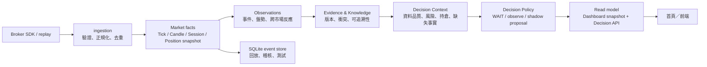

# 空明・市場覺察 Trading Decision Operating System：V2.3 升級計畫

> 對象：現有 `kam-market-ai` Repository。此文件是升級藍圖，不包含程式修改、Repository 重建或新專案建立。

## 1. V2.3 定位與範圍

V2.3 將現有專案收斂為單一的 **市場覺察與交易決策作業系統**：將可驗證的市場資料，轉為可追溯的觀察、證據、情境與決策建議，並以首頁／API 向人呈現「現在看見了什麼、為何如此判斷、仍缺什麼事實、下一步應等待或觀察什麼」。

核心原則：

- **Research / Shadow only**：不新增真實下單權限；`TRADING_ENABLED=False` 維持硬性不變。
- **事實與推論分層**：Tick、K 線、持倉、系統狀態為事實；regime、reaction、evidence、decision 為推論，須保留來源與版本。
- **Fail closed**：資料不新鮮、session 不明、契約未驗證、持倉不可信或關鍵背景缺失時，輸出 `WAIT`／`UNKNOWN`，不可補猜。
- **一個正式核心**：`src/kam_market_ai` 是唯一正式可執行 package。V1.x 子專案只能作為受控的遷移來源與歷史封存。
- **人類最終決策**：V2.3 的 action 是「決策建議／觀察任務」，不是交易指令。

### V2.3 目標資料流

## 2. 可沿用的部分

| 現有項目 | 沿用方式 | V2.3 定位 |
| --- | --- | --- |
| `src/kam_market_ai/config.py` | 保留 fail-closed 設定與禁用真實交易的安全不變量 | platform configuration |
| `authorization/bootstrap.py` | 保持 SDK／帳戶物件只存在於本機授權邊界 | broker authorization boundary |
| `market_data/fubon_neo.py` | 沿用 market-data-only client、Tick decoder、驗證契約 resolver | Fubon quote ingestion adapter |
| `market_data/realtime_probe.py`、`lifecycle_probe.py` | 沿用為驗證行情頻道、契約與生命週期的診斷工具 | connectivity / data-quality probes |
| `models.py`、`session.py`、`candles.py` | 演進既有標準 Tick、Candle、Session 與 deterministic aggregation | shared domain primitives |
| `analysis/observation.py`、`reaction_chain.py` | 沿用 observation 與跨市場反應分析；其「不宣稱因果」設計應保留 | market-awareness layer |
| `analysis/evidence*`、`knowledge*`、`formation*`、`traceability.py` | 沿用版本化、衝突、型態失效與可追溯模型 | evidence / knowledge ledger |
| `decision/hard_gate.py`、`cause_health.py` | 沿用「資料不足即 WAIT」的政策，擴充為全域 decision policy | safety gate |
| `storage/sqlite.py`、`storage/observation_query.py` | 沿用 SQLite 作為本機研究帳本與查詢邊界 | event / projection persistence |
| `execution/shadow.py` | 沿用但只作假設性部位與 MFE/MAE 評估 | shadow simulation |
| V1.x `kam/intraday.py`、`history.py` | 移植經測試驗證的分鐘 K 聚合、5/15/60m 輸入與日／週 MA 計算 | timeframe projection |
| V1.x `kam/engine.py` | 保留其五週期對齊與「等待條件」的領域意圖，重新表達為可解釋 policy | legacy rule source, not final engine |
| V1.x `service.py`、`api.py`、`runtime.py` | 沿用 dashboard snapshot、資料新鮮度與 refresh 的概念 | read-model / API design source |
| 現有 tests | 保留並提升為 V2.3 不變量測試與回放測試的基礎 | regression safety net |

## 3. 需要重構的部分

### 3.1 收斂雙核心

目前 `src/kam_market_ai` 與 `KAM_V1.6_fubon_bridge/kam_v16/kam` 各自有模型、決策與 runtime。V2.3 必須讓所有正式模組都落在 `src/kam_market_ai`，以單一 `pyproject.toml`、單一模型語言和單一測試集維護。

做法是**逐項移植並驗證** V1.x 能力，而非直接複製資料夾或同時維護兩個 engine。遷移完成前，V1.x 僅作 golden-master 對照來源。

### 3.2 統一領域模型與語言

根主線有 `Decision`/`MarketContext`，V1.x 有 `Holding`/`TimeframeInput`/`MarketEvaluation`，目前語意重疊卻不相容。建立下列明確邊界：

- **Fact models**：`MarketTick`、`Candle`、`SessionState`、`PositionSnapshot`、`DataFreshness`。
- **Analysis models**：`Observation`、`Evidence`、`Knowledge`、`MarketRegime`、`ReactionAnalysis`。
- **Decision models**：`DecisionContext`、`DecisionAssessment`、`DecisionRecommendation`、`WaitReason`、`DecisionTrace`。
- **Read models**：`DashboardSnapshot`、`PositionView`、`MarketView`。

任何模型都需有 schema version、觀察／產生時間與來源欄位；資料輸入與儀表板輸出不可直接共用 mutable internal object。

### 3.3 將規則改造成可解釋政策

V1.x `evaluate_market()` 將趨勢、持倉、進出與 UI label 混在一個函式。V2.3 應拆成：

1. `timeframe analysis`：週／日／60／15／5 分鐘各自產出純分析結果。
2. `market synthesis`：輸出同步度、regime、heat、結構狀態與不確定性。
3. `gates`：資料完整性、freshness、session、風險、持倉可信度。
4. `policy`：根據上述結果產出 observe / wait / shadow scenario，不產生 broker order。
5. `explanation`：每項建議固定對應輸入事實、規則版本、理由、反證條件與等待條件。

### 3.4 收斂資料流與持久化

目前根主線 SQLite 側重 observations／evidence，V1.x `MinuteBarBuffer` 與 `SnapshotStore` 只在記憶體。V2.3 要改為「append-only 事實事件 + 可重建 projection」：原始 Tick／Bar、position snapshot、資料健康事件與決策評估都可回放；Dashboard 是可丟棄並重建的 projection。

### 3.5 API 與前端的契約先行

V1.x `KamApi` 是內嵌 WSGI dispatch，無 server、無 versioned schema、無 auth。V2.3 先定義 OpenAPI/JSON Schema 與 response examples，接著再選擇輕量 HTTP framework 或 WSGI host。前端只能讀取 read model，不能直接碰 SDK、資料庫或 policy internal state。

### 3.6 編碼與文件衛生

現有 README、部分舊文件與程式中文字串在目前環境出現編碼異常。V2.3 的文件、來源檔與 JSON 回應應統一 UTF-8；修復前先以原始 bytes、CI lint 與 golden output 驗證，避免「轉碼修復」改變商業規則字串。

## 4. 需要新增的能力

| 能力 | 建議模組／產物 | 最低完成定義 |
| --- | --- | --- |
| Application composition | `bootstrap/` 或 `runtime/application.py` | 一個明確 CLI/service entry point 可組合 replay 或 live quote；預設不連 broker。 |
| Ingestion pipeline | `ingestion/` | Tick/candle validator、sequence/dedup、exchange/receive timestamp、dead-letter／品質事件。 |
| 契約與 quote 正規化 | `market_data/contracts.py`、`quote_service.py` | verified contract map、last quote、quote freshness；歷史 API mapper/decoder 完成官方契約測試。 |
| Session calendar | `calendar/` | 交易日、假日、日夜盤交易日歸屬、session version；取代只靠 weekday/time 的單一判斷。 |
| Position boundary | `positions/` | `PositionProvider`、broker response parser、normalized immutable `PositionSnapshot`、reconciliation status；資料缺失只能是 `UNKNOWN`，不可當作空倉。 |
| Position synchronization | `positions/sync.py` | polling / event refresh、idempotency、來源時間、last-success、差異偵測與 audit event；初版只讀。 |
| Multi-timeframe projections | `projections/timeframes.py` | 日／週與 5/15/60m 的一致 session 對齊、已收線條件與可回放重建。 |
| Decision orchestration | `decision/context.py`、`policy.py`、`explain.py` | 輸出 recommendation、reasons、missing facts、counter-evidence、rule version、input ids。 |
| Risk policy | `risk/position_risk.py` | 依真實／模擬持倉、保證金、曝險、資料新鮮度限制建議強度；不觸發下單。 |
| Read models | `read_models/dashboard.py` | 首頁所需的 market、evidence、decision、position、system-health 一次性 snapshot。 |
| API service | `api/` + OpenAPI | `/v2/health`、`/v2/dashboard`、`/v2/market/quotes`、`/v2/positions`、`/v2/decisions/latest`、`/v2/replay`；讀取 API 與明確 error schema。 |
| Frontend | `frontend/`（同一 Repository） | 首頁顯示資料新鮮度、session、持倉同步狀態、證據鏈、WAIT 原因與風險；不含下單按鈕。 |
| Replay / evaluation | `replay/`、fixtures | 任一決策可由 recorded facts 再現；回測只衡量規則／觀察品質，與下單隔離。 |
| Observability | structured log、metrics、audit trail | 不記錄憑證；可查詢資料延遲、斷線、parser reject、同步失敗與決策分布。 |
| Quality gates | CI、schema checks、property tests | adapter decoder、session 邊界、position reconciliation、decision trace、API contract 有自動測試。 |

## 5. 需要刪除或退役的部分

本階段不刪除任何檔案。完成遷移驗收、回放對照與備份確認後，才依以下清單進行**受控移除或封存**：

| 對象 | 處置 | 前提 |
| --- | --- | --- |
| `KAM_V1.6_fubon_bridge/kam_v16/legacy_fubon/` | 移除 | 已證明只是根主線舊複本，且其必要測試／fixture 已遷入正式 package。 |
| `KAM_V1.6_fubon_bridge/kam_v16/kam/` | 移除或改為 `archive/v1` 唯讀封存 | V1.x engine、API、runtime 功能均遷移，golden-master 結果已固定。 |
| V1.x `examples/` 與 release notes | 封存而非刪除 | V2.3 操作手冊與範例取代，仍保留歷史追溯。 |
| 根目錄 `analysis/evidence_versioning.py` | 移除或移入正式 package | 比對後確認和 `src/.../analysis/evidence_versioning.py` 無獨有邏輯。 |
| 空根目錄 `market_data/` | 移除 | 確認沒有部署腳本依賴該空路徑。 |
| 舊 `log/` 輸出與本機 `.db` | 依資料保留政策清理 | 已匯出／備份且不屬必須稽核資料；絕不以程式碼刪除取代資料治理。 |
| wheel / zip 備份 | 轉移至受控 artifact storage 後移除 | 有來源、版本與校驗資訊；不要把二進位備份當作正式依賴。 |

不應刪除：根主線 authorization 的安全邊界、Shadow executor、observation/evidence/knowledge 模組，以及目前測試；它們是 V2.3 安全與可追溯性的資產。

## 6. 升級至 V2.3 的執行階段

### Phase 0 — 基線與決策契約（V2.0 foundation）

- 指定 `src/kam_market_ai` 為唯一 production package；子專案標註為 migration source。
- 修復或隔離有編碼問題的文字資產，建立 UTF-8 檢查。
- 為 V1.x engine 建立 golden input/output fixtures；不改動其行為。
- 定義 V2 domain glossary、Decision/Position/Quote JSON Schema 與 API contract 草案。
- 訂出資料保留、憑證、日誌遮罩與 Shadow-only policy。

**完成門檻**：新團隊成員可用單一文件知道正式入口、資料模型與 V1.x 對照範圍；所有核心資料結構有版本化契約。

### Phase 1 — 可回放市場事實層（V2.1）

- 完成 ingestion、session calendar、contract verification 和 quote freshness。
- 將 Tick、closed candle、資料健康事件 append-only 寫入 SQLite；建立 deterministic replay。
- 將 V1.x 5/15/60m、日／週計算遷入根 package，加入 session alignment 和 close-bar 測試。
- 補完富邦歷史 candles 的官方 mapper/decoder，或明確保留不支援並提供可驗證替代資料源。

**完成門檻**：給定固定資料集，任次重播均產生相同 Candle/timeframe projection；任何報價都可查到來源與新鮮度。

### Phase 2 — 覺察、證據與決策層（V2.2）

- 接上既有 Observation → Evidence → Knowledge/Formation → Traceability 流程。
- 將 legacy Rule Engine 邏輯拆為 analysis、gates、policy、explanation；以 golden fixtures 防止無意的策略漂移。
- 建立 `DecisionContext`，把資料品質、session、跨市場背景、風險與持倉可信度納入。
- 輸出 `WAIT` 亦必須帶可操作的 missing facts／next observation，而非空白訊息。
- 建立 Shadow scenario lifecycle 與回顧報表，不新增下單 gateway。

**完成門檻**：任一決策都能追溯到 facts、evidence、rule version 和 wait／反證條件；資料不足不能產生「可執行」建議。

### Phase 3 — 持倉同步與作業介面（V2.3）

- 新增 read-only `PositionProvider` 與 parser；先對錄製 payload 及 sandbox 做嚴格 contract tests。
- 實作 position sync/reconciliation：狀態包含 `FRESH`、`STALE`、`UNKNOWN`、`MISMATCH`；決策層對非 `FRESH` 預設降級至 WAIT。
- 建立 Dashboard read model、versioned API 與前端首頁；顯示引用來源、時間、健康度與持倉同步狀態。
- 啟用 service composition、排程、connection recovery、metrics 和告警，但 live mode 仍只讀市場／持倉資料。
- 將 V1.x 檔案移入 archive 或刪除前完成最後 replay parity 與依賴掃描。

**完成門檻**：首頁在一次 API 回應中可呈現市場、證據、決策、持倉與系統健康；持倉不同步、資料過期、session 關閉時明確阻擋 Shadow proposal；無真實下單路徑。

## 7. V2.3 首頁最小資訊架構

首頁不是「買賣訊號板」，而是工作台。建議固定五區：

1. **系統狀態**：市場連線、最後 quote、資料延遲、session、契約版本、position sync 狀態。
2. **市場覺察**：TAIEX/TX/MTX 方向、各週期結構、反應鏈、異常與未確認觀察。
3. **證據與知識**：當前 evidence、相衝突 evidence、形成／失效狀態、來源與版本。
4. **決策工作區**：recommendation、WAIT reason、所缺事實、反證條件、policy/rule version、時間戳。
5. **持倉與風險**：只讀持倉 snapshot、同步時間、reconciliation 結果、Shadow scenario、風險限制。

## 8. 主要風險與控制

| 風險 | 控制措施 |
| --- | --- |
| 兩套 engine 同時演進造成結論不一致 | 明訂單一正式 core；V1.x 只做對照，遷移後封存。 |
| 誤把行情接收時間當市場事件時間 | 保留 `exchange_event_at` 與 `received_at`，禁止以 receive time 推論領先／因果。 |
| 持倉讀取失敗被當作空倉 | 用 `UNKNOWN/STALE/MISMATCH` 狀態；非 FRESH 不允許產生依賴持倉的建議。 |
| 合約月份或歷史 API 欄位被猜測 | 維持 verified resolver 與 explicit mapper/decoder；未知即拒絕。 |
| UI 將 research recommendation 誤解為交易指令 | 將 API／首頁文案固定為 decision support，顯示 Shadow-only 與 data status。 |
| 憑證或帳務資訊外洩 | SDK/account 限制在 authorization/positions 邊界，遮罩 logging，禁止回傳 raw payload。 |
| 回放結果不可重現 | Append-only fact store、schema/rule version、fixture 與 deterministic projection。 |

## 9. 建議的優先順序

1. 先完成單一正式 core、UTF-8／文件與 golden tests。
2. 再完成資料品質、session calendar、可回放事實層。
3. 之後才遷移並重構 Rule Engine 成可解釋 decision policy。
4. Position Parser / sync 必須在 decision trace 與資料新鮮度機制完成後加入。
5. API 與首頁最後接上，讓其消費穩定 read models，而非反向驅動核心設計。

這個順序能保留現有「市場資料與帳戶資料隔離、資料不足即等待、Shadow-only」的安全設計，同時把 V1.x 的多週期與 dashboard 資產納入可維護的 V2.3 平台。

