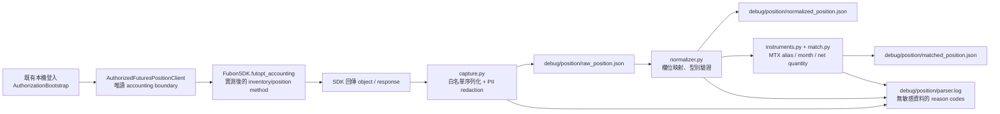

# V2.3.1：富邦期貨持倉同步實作計畫

> 範圍唯一目標：以**唯讀**富邦期貨持倉查詢，可靠辨識使用者實際持有的「微型臺指期貨（MTX）」一口，並產出可稽核的 raw／normalized／matched debug 檔案。本文為實作計畫；本輪沒有修改程式、帳密、憑證，沒有登入帳戶，也不會送出委託。

## 範圍鎖定

本階段只新增持倉讀取、捕捉、正規化、微型臺指辨識、JSON debug 輸出與離線 parser 測試。不做首頁、Decision API、即時行情、3/5/10 日分析、AI 摘要、整體架構重構，也不合併、封存或刪除 V1.x。

`TRADING_ENABLED=False` 必須維持；所有新增 SDK interaction 僅允許讀取 futures accounting/inventory，程式中不得 import 或呼叫 order 類別、下單、改單、刪單、平倉等 API。

## 0. 目前已確認與必須在實作時確認的 SDK 事實

- 本機 wheel 為 `fubon_neo` **2.2.8**；唯讀介面盤點確認 `FubonSDK` 有 `futopt_accounting` 屬性，亦有 `futopt` 與市場資料初始化能力。
- 現有 `AuthorizationBootstrap` 明確丟棄登入回傳值，且只輸出 market-data clients；這是正確安全設計，但不能直接提供持倉資料。
- 在**未登入、未取得期貨帳號物件**的情況下，無法誠實地斷言 `futopt_accounting` 的確切查詢方法名稱、輸入帳號型別與回傳 class。不得靠猜測建立 parser。

V2.3.1 的第一個實作驗收步驟是經使用者明確授權的一次**唯讀**本機查詢：記錄 `type(result).__module__`、`type(result).__qualname__`、安全欄位清單、容器層級與一份去識別 raw JSON。預期會驗證 `sdk.futopt_accounting` 下的 inventory/position 查詢入口；只有 SDK 實際回傳證據可以確定最終 method 與型別。登入帳密、憑證、token、完整帳號及原始 SDK object 均不得寫入輸出。

## 1. 預計新增與修改的確切檔案

| 動作 | 檔案 | 責任 |
| --- | --- | --- |
| 修改 | `src/kam_market_ai/authorization/bootstrap.py` | 在既有登入成功後，以最小權限建立**唯讀** `AuthorizedFuturesPositionClient`；只暴露已驗證的期貨 accounting 查詢 callable 與選定期貨帳號識別，不外流 `FubonSDK`、login result、order/account object。不得變更 credentials schema。 |
| 新增 | `src/kam_market_ai/positions/__init__.py` | 匯出公開、唯讀的 position model／parser API。 |
| 新增 | `src/kam_market_ai/positions/models.py` | 定義不可變的 `RawPositionCapture`、`NormalizedFuturesPosition`、`MatchedPosition`、`PositionSyncStatus` 與 parser warning/error 結構；所有 monetary/quantity 欄位採 `Decimal` 或 JSON-safe string，避免 float 誤差。 |
| 新增 | `src/kam_market_ai/positions/fubon.py` | SDK adapter：封裝已驗證的 `futopt_accounting` 查詢入口、實際回傳型別 probe、無副作用 object→JSON-safe raw conversion；僅允許白名單 accounting method。 |
| 新增 | `src/kam_market_ai/positions/capture.py` | 寫出 `debug/position/raw_position.json`；加入 capture 時間、SDK version、return type、schema fingerprint、redaction metadata，不寫入憑證或帳號。 |
| 新增 | `src/kam_market_ai/positions/normalizer.py` | 將 raw rows 解析成正規化 futures position；未識別／欄位衝突時保留 warning 並拒絕宣稱 MTX 1 口。 |
| 新增 | `src/kam_market_ai/positions/instruments.py` | 微型臺指 aliases、商品／月份 canonicalization 與 MTX matching policy；只做商品識別，不查行情。 |
| 新增 | `src/kam_market_ai/positions/match.py` | 對 normalized positions 聚合、篩選 MTX、判定 long/short/net quantity，輸出 matched 結果與 match rationale。 |
| 新增 | `src/kam_market_ai/positions/cli.py` | 明確 `--live-read` 才執行一次唯讀同步；預設 `--fixture`／dry-run。依序產出四個指定 debug 檔；沒有 loop、排程或下單分支。 |
| 修改 | `src/kam_market_ai/logging_config.py` | 將帳號、身分證號、token 與常見 position raw identity keys 納入 redaction filter；保留 parser reason code。 |
| 修改 | `.gitignore` | 忽略 `debug/position/` 與所有 capture JSON/log，避免含敏感財務資料的 debug 檔被提交。 |
| 新增 | `tests/fixtures/positions/fubon_mtx_long_1.json` | 去識別的 SDK raw fixture：微型臺指多單 1 口。 |
| 新增 | `tests/fixtures/positions/fubon_mtx_short_1.json` | 去識別 fixture：微型臺指空單 1 口。 |
| 新增 | `tests/fixtures/positions/fubon_mixed_and_unknown.json` | 去識別 fixture：TX/MTX 混合、未知商品／缺欄位／多格式月份。 |
| 新增 | `tests/test_position_normalizer.py` | 純離線 mapping、direction、quantity、average/current/P&L 與 fail-closed 測試。 |
| 新增 | `tests/test_position_matcher.py` | MTX alias、月份、聚合、一口辨識、雙向／衝突和 unknown 測試。 |
| 新增 | `tests/test_position_capture.py` | fake accounting client 的 raw JSON、去識別、return-type metadata、檔案名稱與 log 測試；不登入。 |
| 新增 | `tests/test_fubon_position_adapter.py` | fake SDK accounting 介面的 allowlist／禁止 order API／錯誤轉換測試；不連真實帳戶。 |

不修改：`src/kam_market_ai/market_data/fubon_neo.py`（它應繼續拒絕帳戶物件）、V1.x 子專案、任何 `.env`／帳密／憑證、execution/shadow 的交易限制。

## 2. SDK → Raw → Normalize → Match → JSON 資料流

### 執行模式

- **預設 fixture/dry-run**：只讀 `tests/fixtures/positions/*.json`，可在沒有帳戶、SDK token 或網路時執行 parser／輸出流程。
- **`--live-read`**：必須由使用者顯式觸發；只進行一次帳戶持倉 read，隨即將已去識別 capture 交給相同 parser。不得建立背景 thread、輪詢、WebSocket、行情查詢或任何委託。
- 每次 live read 覆寫四個本機 debug 檔（或以 atomic write 避免半檔）；不寫入 SQLite，因本階段需求僅要求 debug JSON。

## 3. Debug 輸出契約

| 路徑 | 內容 | 禁止內容 |
| --- | --- | --- |
| `debug/position/raw_position.json` | `captured_at`、SDK package version、return type、method identifier、schema keys、去識別後 raw response | 密碼、憑證路徑／密碼、token、完整帳號、身分證號、SDK object repr。 |
| `debug/position/normalized_position.json` | 所有成功／失敗正規化 rows、source row index、欄位來源、warnings、parser version | 未遮罩原始 identity、未經驗證的推測欄位。 |
| `debug/position/matched_position.json` | MTX matching policy version、matched rows、月份、side、net quantity、是否「實際 MTX 1 口」、match reason | 行情訂閱結果或決策／下單資訊。 |
| `debug/position/parser.log` | UTC timestamp、階段、severity、safe reason code、row index、商品 canonical code | raw payload、帳號、credentials、token、完整例外 response。 |

檔案的 JSON 使用 UTF-8、明確 schema version；缺值使用 `null`，不可用 `0` 代表未知。

## 4. 持倉欄位映射表

下表是**正規化目標與驗證規則**。SDK source field 的最終名稱，必須以第一份 raw capture 實測結果填入；在未確認前只列 candidate names，不能把 candidate 視為契約。

| Normalized 欄位 | 必填 | SDK source candidate（待 raw 確認） | 正規化規則 |
| --- | --- | --- | --- |
| `source_row_id` | 是 | row index / id / contract id | 不可重複；只供 trace。 |
| `symbol_raw` | 是 | `symbol`、`code`、`contract_code`、`stock_no` | 保留原字串，trim/uppercase，不改寫原值。 |
| `product_code` | 是 | symbol 中 product segment 或 product field | 依 alias map 轉 `MTX`/`TX`/`UNKNOWN`。 |
| `contract_month` | 是（對 MTX） | `contract_month`、`delivery_month`、symbol suffix | 只接受可解析為 `YYYYMM` 的格式；失敗即 unknown，不猜最近月。 |
| `side` | 是 | `buy_sell`、`bs_action`、`side`、`direction` | map 為 `LONG`/`SHORT`/`UNKNOWN`；未知不以正數 quantity 推斷。 |
| `quantity` | 是 | `quantity`、`qty`、`volume`、`position_qty` | 解析為非負整數的 gross quantity；小數、負號語意不明即 reject。 |
| `average_price` | 否 | `average_price`、`avg_price`、`cost_price` | `Decimal`；不存在為 `null`。 |
| `current_price` | 否 | `current_price`、`last_price`、`market_price` | 僅使用 accounting response 內帶的值；**不得額外訂閱或查詢即時點數**；不存在為 `null`。 |
| `unrealized_pnl` | 否 | `unrealized_pnl`、`floating_pnl`、`unrealized_profit_loss` | `Decimal`，保留正負；無值為 `null`。 |
| `currency` | 否 | `currency`、`currency_code` | 預設不可猜；未提供為 `null`。 |
| `source_updated_at` | 否 | `update_time`、`query_time`、response timestamp | 含時區 ISO-8601；不可從本機 capture time 倒推。 |
| `parse_status` / `warnings` | 是 | parser 產生 | `NORMALIZED`、`REJECTED`、`PARTIAL` 和 machine-readable reason codes。 |

## 5. 商品代碼與月份辨識策略

### 微型臺指 canonical product

唯一 canonical code 為 `MTX`。matcher 只在 product 可驗證為 `MTX`、月份可解析、side 可判定、quantity 可判定時，才將 row 納入 matched result。

### Alias 對照策略

1. 以 SDK raw 的 product/code 欄位為最高優先；其次才解析 symbol。
2. 使用版本化、明示的 aliases，例如 `MTX`、`MTXF`、`TMF`、以及經 raw capture/官方 SDK 文件證實的中文名稱或 exchange symbol。初版 alias table 不納入未驗證猜測。
3. 標準臺指 `TX`、小型臺指 `MTX` 以外的商品，必須明確列為 non-MTX；不得因包含 `TX` 字樣便匹配 MTX。
4. 期貨月份可接受的輸入格式在實測後白名單化，例如 `YYYYMM`、`YYYY-MM`、SDK 既有 month enum 或 symbol suffix；全部輸出成 `YYYYMM`。
5. 週選、選擇權、spread、calendar spread、無月份代碼或無法確認 product 的 row 都輸出 `UNMATCHED` 並寫 warning；不推測代表微型臺指單腿。

## 6. 多空方向與口數判斷規則

1. `side` 只由 SDK 明示的買賣／多空 enum 或已驗證字串映射：買／多／B／BUY／LONG → `LONG`；賣／空／S／SELL／SHORT → `SHORT`。最終字串表以 raw capture 的 enum value 固定。
2. `quantity` 一律先轉為非負的**gross integer**。若 SDK quantity 已帶符號，符號只有在官方／實測確認其語意時才可與 side 交叉驗證；不可單獨據此推論 side。
3. 相同 `(canonical product, contract_month, side)` 的 rows 才可相加。不同月份不可互抵；不同帳戶（若未完全遮罩前可用不可逆 token 分區）不可互抵。
4. `net_quantity = long_gross - short_gross` 只做同月份聚合。結果 `+1` 代表該 MTX 月份淨多 1 口，`-1` 代表淨空 1 口。
5. 「正確辨識實際持有微型臺指 1 口」需同時滿足：
   - matched MTX row 的 product、month、side、quantity 全部是 verified；
   - 該月份 `abs(net_quantity) == 1`；
   - 沒有同月 opposite-side row、duplicate row、parse reject 或未處理的 reconciliation conflict；
   - capture metadata 顯示 query 成功且 raw schema 已被支援。
6. 多單與空單同時出現、quantity 大於 1、商品／月份／方向未知、或 raw 回傳空集合時，matched JSON 必須明確輸出 `NOT_SINGLE_MTX_POSITION`／`UNKNOWN`／`EMPTY`，絕不可把它顯示為「MTX 1 口」。

## 7. Parser 單元測試案例

以下測試全使用 fixture/fake adapter，不連富邦、不讀 `.env`、不需要憑證。

| 類別 | 案例 | 預期 |
| --- | --- | --- |
| SDK boundary | 非 allowlisted accounting method | adapter 拒絕，無 order API access。 |
| Raw capture | dataclass/object/list/dict response | 產出 JSON-safe capture、type metadata、無敏感 key。 |
| Raw capture | account/token/identity key 出現在 raw | 值被 redacted，parser log 也不洩漏。 |
| Normalizer | 已驗證 MTX 多單、quantity `1` | `product_code=MTX`、`side=LONG`、quantity `1`。 |
| Normalizer | 已驗證 MTX 空單、quantity `1` | `side=SHORT`、quantity `1`。 |
| Normalizer | avg/current/P&L 是 int、float、numeric string、null | 無精度遺失地轉 `Decimal` 或 null。 |
| Normalizer | 缺 symbol/side/quantity 或非法 quantity | `REJECTED/PARTIAL` 並有精確 reason code，不 matching。 |
| Instrument | `MTX`、已證實 alias、`TX`、未知符號 | 只前兩者（若 alias 已驗證）匹配 MTX；TX 不匹配。 |
| Month | `YYYYMM`、核准格式、無效月份、缺 suffix | canonical `YYYYMM` 或 `UNKNOWN`，絕不猜當月。 |
| Matcher | 同月 MTX long 1 | `is_single_mtx_position=true`、net `+1`。 |
| Matcher | 同月 MTX short 1 | true、net `-1`。 |
| Matcher | long 1 + short 1 / duplicated row | conflict，非 single position。 |
| Matcher | MTX 兩口／不同月份各一口 | 非「實際持有 MTX 1 口」；結果列出每月份。 |
| Offline execution | CLI fixture mode | 生成四個指定檔案；不 import live SDK login、不建立網路連線。 |

## 8. 風險與未知事項

| 項目 | 風險 | 控制／待確認事項 |
| --- | --- | --- |
| SDK method / return type | `futopt_accounting` 的真實 inventory method、帳戶參數與 class 尚未由 live result 證實 | 第一個 live-read 必須只做 probe/capture；將 type、keys 與 sanitized fixture 固定後才寫 final field mapper。 |
| 多帳戶 | SDK login 可能回傳多個期貨帳戶；聚合會誤把不同帳戶視為一個持倉 | matched result 預設分帳戶 token；未選帳戶時輸出 ambiguity，不跨帳戶 net。 |
| 當沖／鎖倉語意 | futures response 可能以交易別、買賣別或已平倉／未平倉欄位呈現 | 只採可驗證的未平倉 inventory row；必要時要求官方文件／user capture 確認。 |
| 商品符號 | 富邦／期交所 symbol 與月份格式可能不同，alias 過寬會誤匹配 | alias 最小化、版本化；未知即 UNMATCHED。 |
| 現價與 P&L | accounting response 可能沒有 current price 或 P&L，且本階段禁止即時點數 | 欄位可為 null；不以行情補值。 |
| 敏感資料 | raw capture 可能包含帳號、姓名、token 或財務資訊 | debug directory gitignore、key/value redaction、無 raw repr、最小檔案權限；使用者自行保管本機檔案。 |
| 現有 security boundary | 把完整 SDK/account 向下傳會破壞 market-data-only 設計 | 新增獨立 narrow position facade；不得改寬 `AuthorizedMarketDataClients`。 |
| 實際交易安全 | accounting SDK 與 order SDK 同源，誤用風險高 | import/call allowlist、靜態測試禁止 order 名稱、Shadow-only regression test。 |

## 9. 最小可交付順序

1. **SDK read-only probe 契約**：確認 `futopt_accounting` 最終 method、輸入帳戶型別、return type；只產生去識別 raw capture，無 parser 判斷。
2. **離線資料契約**：由 capture 形成匿名 fixture，鎖定 raw schema、redaction 與 type metadata；先完成 capture tests。
3. **純 parser**：完成 models、normalizer、instrument aliases、month/direction/quantity 規則及 fixture tests。
4. **MTX matcher**：完成同商品同月份 side aggregation 和「exactly one」嚴格結果；完成所有衝突／unknown tests。
5. **一次性 CLI 與四檔輸出**：接上 narrow read-only SDK facade；fixture mode 必須能完全離線執行，`--live-read` 額外需顯式確認。
6. **最終驗收**：以使用者的實際去識別 capture 驗證 matched JSON 清楚顯示 MTX long/short 1 口或明確 unknown/conflict；確認 `TRADING_ENABLED=False`、無 order 呼叫、V1.x 檔案未變動。

完成 V2.3.1 後的結果僅是可信的「唯讀持倉事實」與 debug 證據；它不會自動進入 Rule Engine、首頁、Decision API 或任何交易執行路徑。

